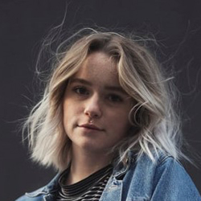

# Personas

## 1. Introdução

Personas são personagens fictícios para simular um grupo de usuários reais.

## 2. Personas
### 2.1 José Almeida Camargo

<figcaption>Imagem 1: Persona José Almeida Camargo.</figcaption>

- Idade: 46.
- Sexo: Masculino.
- Escolaridade: Ensino Superior Completo.
- Profissão: Designer Gráfico.
- Expectativas: Deseja assistir séries exclusivas, que foram lançadas recentemente.

José tem 46 anos, casado, formado em Design Gráfico e atualmente trabalha em uma empresa focada em edição de vídeos. José mora com sua esposa em um apartamento, e no final de semana eles gostam de assistir séries e filmes que nunca assistiram antes.

  
### 2.2 Cristina Rodrigues

 

<figcaption>Imagem 2: Persona Cristina Rodrigues.</figcaption>

- Idade: 22.
- Sexo: Feminino.
- Escolaridade: Ensino Superior Incompleto.
- Profissão: Estudante.
- Expectativas: Deseja assistir séries famosas no seu tempo livre.

Cristina tem 22 anos, é solteira, e atualmente está cursando psicologia em uma universidade federal. Ela adora a série Supernatural e sempre que tem uma folga gosta de assistir sozinha em seu quarto.

### 2.3 Juliana Pereira de Jesus

<figcaption>Imagem 3: Juliana Pereira de Jesus.</figcaption>

- Idade: 63.
- Sexo: Feminino.
- Escolaridade: Ensino Fundamental Completo.
- Profissão: Dona de casa.
- Expectativas: Deseja assistir filmes e séries.

Juliana tem 63 anos, mora em sua casa no interior, é casada, tem tres filhas. Ela passa o dia cuidando de sua casa, ao final da tarde quando a programação da televisão aberta não lhe agrada ela gosta de procurar por séries e filmes em aplicativos de streaming utilizando sua smartTv.

  
## 3. Antipersona
### 3.1 Divino Borges

<figcaption>Imagem 4: Antipersona Divino Borges.</figcaption>

- Idade: 58.
- Sexo: Masculino.
- Escolaridade: Ensino Superior Completo.
- Profissão: Professor Aposentado.
- Expectativas: Deseja ouvir os seus canais de rádio favoritos.

Divino Borges mora sozinho em sua chácara, que se mudou após muitos anos de trabalho como professor. Divino agora gosta de ouvir seus canais de rádio favoritos durante todo o dia enquanto realiza atividades corriqueiras ou até mesmo quando está descansando na rede no fim da tarde.

  
## 2. Histórico de versionamento

|Versão|Data de modificação|Descrição da modificação|Autor|
|-|-|-|-|
|1.0|19/02/2022|Criação do documento de personas|[Antonio Igor]('https://github.com/antonioigorcarvalho') e [Lameque Fernandes]('https://github.com/lamequefernandes')|
