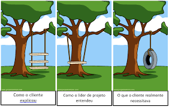

# Observação/Etnografia

## 1 . Definição

Originada da antropologia a Etnografia/Observação é uma técnica que pode ser utilizada para compreender os requisitos sociais e organizacionais, nesta técnica o analista se insere no ambiente de trabalho em que o sistema será utilizado. o principal objetivo da etnografia é descobrir requisitos implícitos que mostram processos reais ao invés de formais, onde os usuários estão envolvidos, também é uma técnica que ajuda a complementar ou negar informações obtidas com outras técnicas de elicitação.

## 2 . Vantagens e Desvantagens
### Vantagens

A observação pode ser a melhor solução para obter uma visão prática e realista
do projeto. Ela permite identificar fluxos de informações informais e a maneira
como as pessoas realmente trabalham.

### Desvantagens

O uso da observação se restringe a processos existentes. Quando o projeto
implica implementar um novo processo de negócio ou produto inteiramente
novo.

## 3 . Quando usar

O uso da observação se deve quando não e possível determinar algo ou e preciso de mais variáveis para ajustar o projeto a melhor situação agradavel para o usuário.
Um exemplo muito utilizado para descrever este método e do cliente que pede um balanço na árvore mas não especifica

<figcaption>Imagem 1: Exemplo Observacao.</figcaption>

## 4 . Metodologia
Para utilização desta tecnica usamos a participação individual depois a junção das ideias com o grupo atraves de uma video chamada no Discord para podermos analisar melhor o uso da Observação e ter uma ampla noção de estudo de campo melhor.

<justify>

## 5 . Requisitos

| Número | Requisitos Abordados                                      |
| :------: | :--------------------------------------------------: |
| 1   | O usuário pode criar novos perfis|
| 2   | O usuário pode excluir perfis|
| 3   | O usuário pode usar o Watch party|
| 4   | O usuário pode pode alugar canais, filmes e series|
| 5   | O usuário pode pode ocultar vídeos|
| 6   | O usuário pode desvincular os dispositivos |
| 7   | O usuário pode excluir historico de navegação|
| 8   | O usuário pode adicionar a lista |
| 9   | O usuário pode ver informações dos atores |
| 10  | O usuário pode diminuir o consumo de dados|
| 11  | O usuário pode assitir o trailer |
| 12  | O usuário pode ver detalhes da obra |

<figcaption>Tabela 1: Requisitos levantados pela técnica de observação sobre o prime video.</figcaption>

## 6 . Referência bibliográfica

> - Técnicas para levantamento de requisitos. **Devmedia**. Disponível em: https://www.devmedia.com.br/tecnicas-para-levantamento-de-requisitos/9151#:~:text=A%20etnografia%20%C3%A9%20uma%20t%C3%A9cnica,o%20sistema%20e%20sua%20hist%C3%B3ria.
> - Levantamento de requisitos com Observação/Etnografia. **fattocs**. Disponível em: https://www.fattocs.com/engenharia-de-requisitos/levantamento-de-requisitos-com-observacao-etnografia/
> - PRESSMAN, Roger S. Engenharia de Software. São Paulo. Ed. Markon Books, 1995
> - Vazquez, Carlos E. Engenharia de requisitos software orientado a negocios. Rio de Janeiro. Ed. Abreu’s System, 2016

## 7. Histórico de versionamento

|Versão|Data de modificação|Descrição da modificação|Autor| revisor|
|-|-|-|-|-|
|1.0|19/02/2022|Criação do documento sobre as ferramentas|Erick Levy| Douglas Monteles |

