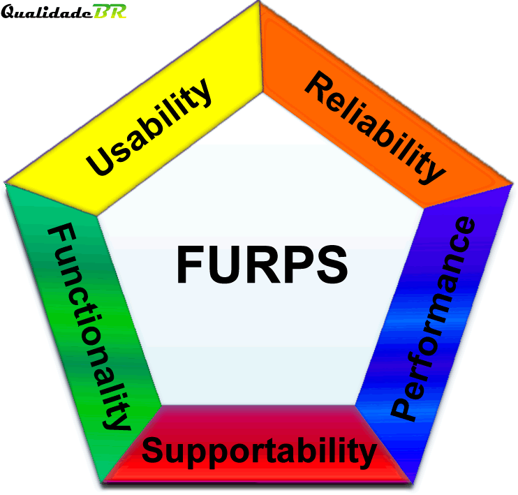

# Especificação Suplementar

## 1. Definição

  A Especificação Suplementar objetiva tratar dos requisitos não-funcionais, os quais não são capturados pelos diagramas de caso de uso (que tratam apenas dos requisitos funcionais), servindo então, para completar toda a análise de requisitos sobre o sistema.

  Essa especificação discore sobre requisitos não-funcionais do sistema analisado, são eles: 

  <ul>
    <li>Confiabilidade</li>
    <li>Utilidade</li>
    <li>Desempenho</li>
    <li>Capacidade de suporte</li>
    <li>Questões legais de utilização do software</li>
    <li>Ambiente de produção (hardware, internet, plataforma, banco de dados)</li>
  </ul> 

  Demais requisitos estão definidos na espqcificação de casos de uso, a qual trata dos requisitos funcionais.

## 2. Objetivo

Facilitar no processo de classificação dos requisitos funcionais e não-funcionais de um software.

<figure>
  
  <figcaption>Figura 1: Representação do FURPS+</figcaption>
</figure>

## 3. Metodologia

  Para tratar dos requisitos não-funcionais deste projeto, foi adotado o sistema de classificação de requisitos <strong>FURPS+</strong>, que é um acrônimo das categorias que serão utilizadas na definição dos requisitos.

##  3.1 <strong>F</strong>unctionality

  Funcionalidade (Functionality) trata da representação de todo o aspecto funcional do sistema, ou seja, ele verifica o cumprimento de todos os requisitos estabelecidos. Podem englobar os seguintes quesitos, mas não fica restrito somente a eles.

  <ul>
    <li>Segurança</li>
    <li>Recursos</li>
  </ul> 

## 3.2 <strong>U</strong>sability

  Usabilidade (Usability) é responsável por avaliar como a interface lida com o usuário. Elas está dividida em várias categorias, são elas:

  <ul>
    <li>Prevenção de erros</li>
    <li>Estética e design</li>
    <li>ajudas (Help)</li>
    <li>Consistência e padrões.</li>
  </ul> 

## 3.3 <strong>R</strong>eliability

  Confiabilidade (Reliability) é a junção dos quesitos de integridade (preservação da informação, preservando a sua consistencia), conformidade (Atende aos requisitos estabelecidos previamente) e interopelabilidade (capacidade de se comunicar com outros sistemas).

  <ul>
    <li>Freqüência e gravidade de falha</li>
    <li>Possibilidade de recuperação</li>
    <li>Possibilidade de previsão</li>
    <li>Exatidão</li>
    <li>Tempo médio entre falhas</li>
  </ul> 

## 3.4 <strong>P</strong>erformance

  Desempenho (Performance) trata dos requisitos de desempenho do software, tais como a sua velocidade de resposta sobre uma dada ação do usuário. Possui diversos aspectos, tais como:

  <ul>
    <li>Tempo de resposta</li>
    <li>Consumo de memória</li>
    <li>Utilização da CPU</li>
    <li>Capacidade de carga</li>
    <li>Disponibilidade da aplicação</li>
  </ul> 

## 3.5 <strong>S</strong>upportability

  Suportabilidade (Supportability) é um dos quesitos que definem a qualidade de um software, ele trata da capacidade de oferta de suporte técnico ao usuário. Possui diversas características, tais como:

  <ul>
    <li>Testabilidade</li>
    <li>Adaptabilidade</li>
    <li>Manutenibilidade</li>
    <li>Compatibilidade</li>
    <li>Instalabilidade</li>
    <li>Escalabilidade</li>
    <li>Localizabilidade entre outros.</li>
  </ul> 

## 4. Referências

https://www.cin.ufpe.br/~gta/rup-vc/extend.formal_resources/guidances/examples/resources/supplspec_v1.htm

https://qualidadebr.wordpress.com/2008/07/10/furps/

## 5. Histórico de versionamento

|Versão|Data de modificação|Descrição da modificação|Autor| Revisor|
|-|-|-|-|-|
|1.0|27/02/2022|Criação do documento sobre a Especificação Suplementar|[Douglas Monteles](https://github.com/douglasmonteles)||