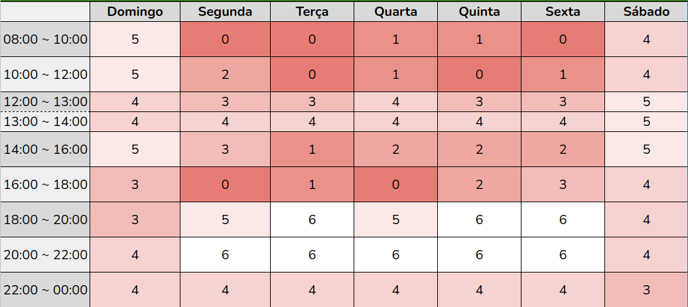

# Cronograma

## 1. Introdução

Com base nos prazos estipulados pela disciplida e disponibilidade dos integrantes foi montado o seguinte cronograma: 

## 2. Cronograma de atividade

| Sprint | Título       | Data                                           | Descrição        | Apresentação        |
| :------: | :----------: | :---------------------------------------------------: | :------------: | :------------: |
| I    | Pré - Rastreabilidade | 30/01 ~ 06/02 | Planejamento do projeto e RichPicture | 08/02 |
| II    | Elicitação de Requisitos | 07/02 ~ 20/02 | Técnicas e Priorização | 22/02 |
| III    | Modelagem de Requisitos | 21/02 ~ 06/03 | Cenários, Léxico, Casos de Uso e Especificação Suplementar | 08/03 |
| IV    | Modelagem de Requisitos - Ágil | 07/03 ~ 09/03 | Histórias de Usuário, Backlog e NFR Framework | 10/03 |
| V    | Análise de Requisitos | 10/03 ~ 23/03 | Verificação & Validação | 24/03 |
| VI    | Pós-Rastreabilidade | 24/03 ~ 03/04 | Gerência de Desenvolvimento de Software orientada à baseline de Requisitos | 05/04 |
| VII    | Projeto final | 04/04 ~ 25/04 | Finalização do projeto final | 26/04 ~ 28/04 |

## 3. Tabela de atividades
### Sprint 1

| Tarefas         | Responsável   | Revisor         | Entrega Prevista |
| --------------- | ------------- | --------------- | ---------------- |
| Criação do documento "Sobre o projeto" | Douglas       | Levi            | 04/fev           |
| Criação do cronograma      | Antonio       | Caio            | 04/fev           |
| Descrição das ferramentas utilizadas | Levi          | Savio           | 04/fev           |
| Criação do documento "Metodologias" | Savio         | Lameque         | 04/fev           |
| Rich Picture | Caio          | Douglas         | 04/fev           |
| Implantação do GitHub Pages | Lameque       | Antonio         | 05/fev           |
| Gravação da apresentação 1  | Todos         | Todos           | 06/fev           |

## 4. Heatmap

<figure>
  
  <figcaption>Figura 1: Mapa de calor (Heatmap)</figcaption>
</figure>

## 2. Histórico de versionamento

|Versão|Data de modificação|Descrição da modificação|Autor|
|-|-|-|-|
|1.0|04/02/2022|Criação do documento de cronograma|[Antonio Igor]('https://github.com/antonioigorcarvalho')|
|1.0.1|05/02/2022|Alteração no titulo e adição do historico de versão|[Lameque Fernandes]('https://github.com/lamequefernandes')|
|1.0.2|09/02/2022| Atualização do cronograma, criação da tabela de atividades |[Antonio Igor]('https://github.com/antonioigorcarvalho')|
|1.0.3|14/02/2022| Adicionando legendas nas imagens |[Douglas Monteles]('https://github.com/douglasmonteles')|
|1.0.3|14/02/2022| Adicionado referências |[Lameque Fernandes]('https://github.com/lamequefernandes')|

## 5. Referências

Plano de ensino da matéria. Disponível em: https://aprender3.unb.br/pluginfile.php/1668087/mod_resource/content/17/Plano_de_Ensino%20RE%2022021%20Turma%20A.pdf. Acesso em: 19/02/2022