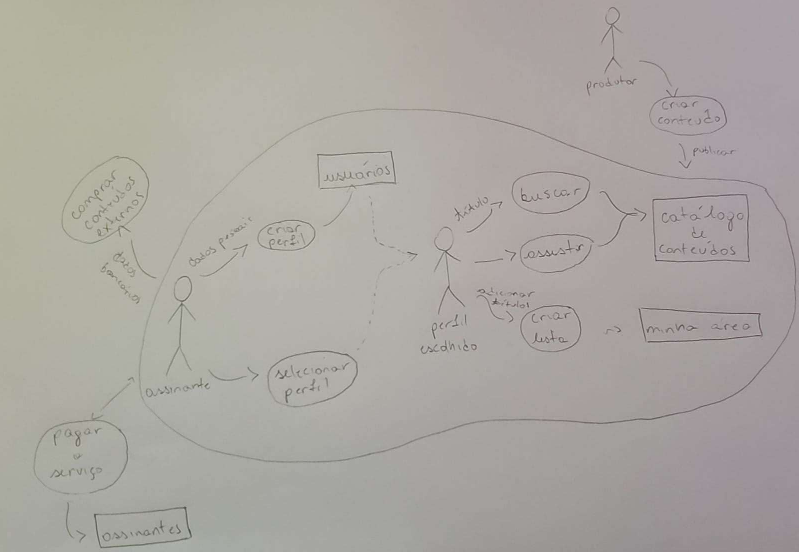
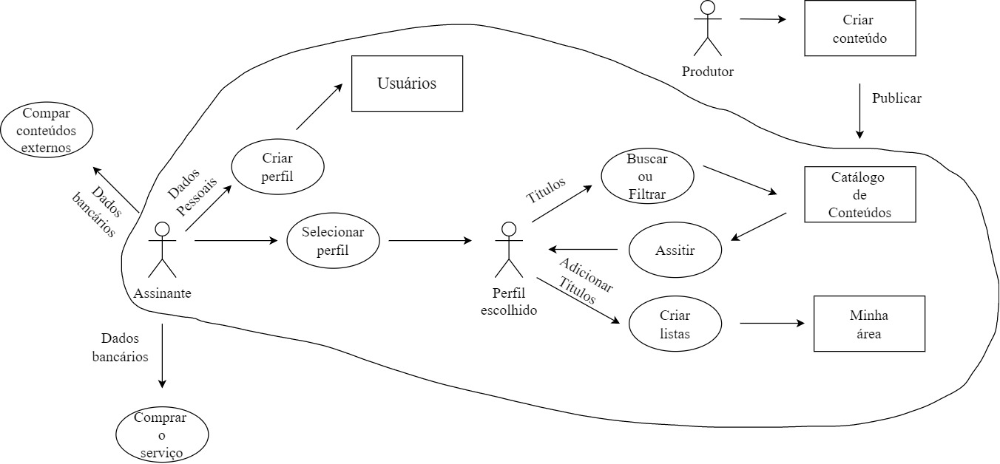

# RichPicture

## 1. Introdução

Um Rich Picture é um artefato utilizado a fim de demonstrar, atráves de um desenho, problemas que devem ser solucionados. Neste desenho deve conter os principais elementos e relacionamentos, para auxiliar a representação do sistema.

## 2. Versões do Rich Picture

### 2.1 Versão 1.0

### 2.2 Versão 1.1

## 3. Histórico de versionamento

|Versão|Data de modificação|Descrição da modificação|Autor|
|-|-|-|-|
|1.0|30/01/2022|Primeiro Rich Picture com a visão geral|Caio Santos|
|1.1|03/02/2022|Pequenas modificações no RichPicture|Caio Santos|
|1.2|05/02/2022|Adição de titulo, introdução e historico de versão|LamequeFernandes|
